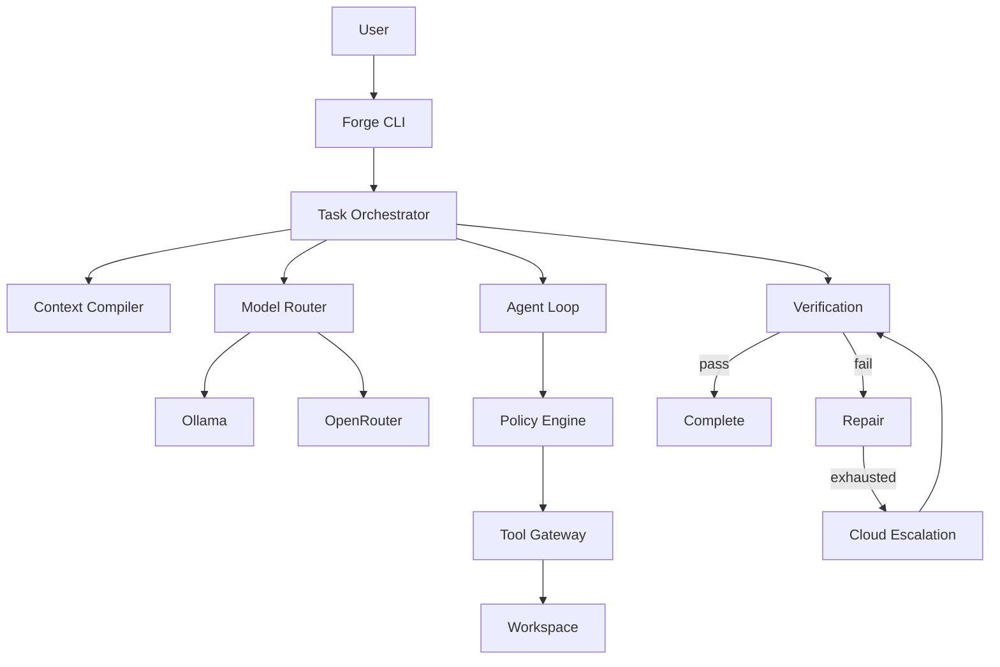

# Forge — Local-First Hybrid Autonomous Coding Harness

Forge is a **local-first, cloud-escalating autonomous software-engineering runtime**.

You describe an objective. Forge understands the repository, builds context, routes to a model (preferring local Ollama), lets the model propose tool calls, authorizes and executes them under policy, verifies independently, repairs on failure, and optionally escalates to OpenRouter.

```text
MODEL PROPOSES → FORGE AUTHORIZES → TOOL EXECUTES → TESTS VERIFY → FORGE DECIDES
```

Forge—not the model—owns state, permissions, budgets, routing, verification, audit history, escalation, and termination.

## Why local-first

- Keep source code on your machine by default
- Use free/local models via Ollama when they are good enough
- Escalate to cloud only when policy allows and local attempts fail
- Never silently send a `local-only` task to the cloud

## Architecture



See [docs/architecture.md](docs/architecture.md) for details.

## Security model

- Workspace path sandbox (blocks `../`, absolute paths, symlink escape)
- Command allowlist (no unconstrained shell)
- Repository content is **untrusted DATA** — it cannot grant permissions, change routing, raise budgets, or disable verification
- Secrets (`.env`, keys) are denied by policy and never logged

See [docs/security.md](docs/security.md).

## Requirements

- Node.js 22+
- pnpm
- Git
- Ollama (for local inference)
- Optional: OpenRouter API key (for cloud escalation)
- Optional: Docker (for `commands.sandbox` = `auto` | `docker`)

## Installation

```bash
pnpm install
pnpm build
pnpm forge -- doctor
```

From this repository, prefer:

```bash
pnpm forge -- <command>
```

After `pnpm build`, you can also run `node dist/cli/index.js`.

> **Name collision:** Atlassian’s `@forge/cli` and Ethereum Foundry also ship a `forge` binary. This package also exposes `forge-harness` as an unambiguous alias. If `forge` on your PATH is another tool, use `pnpm forge` (in this repo) or `forge-harness` after linking this package.

## Ollama setup

1. Install [Ollama](https://ollama.com)
2. Pull a model of your choice, e.g. `ollama pull llama3.2`
3. Configure:

```bash
# .env (never commit)
OLLAMA_BASE_URL=http://localhost:11434
OLLAMA_MODEL=llama3.2
```

Forge does **not** hard-code a model name. You choose.

## OpenRouter setup (optional)

```bash
OPENROUTER_API_KEY=sk-or-...
OPENROUTER_MODEL=openai/gpt-4o-mini
OPENROUTER_MAX_COST_USD=1.0
```

Forge works in local-only mode without an OpenRouter key.

## Quick start

```bash
cd your-project
forge init
forge doctor
forge models
forge run "Fix the failing signup tests" --mode local-preferred
forge status <task-id>
forge inspect <task-id>
```

### Routing modes

| Mode | Behavior |
|------|----------|
| `local-only` | Ollama only. Never cloud. |
| `local-preferred` | Ollama first; escalate after repair budget if cloud configured |
| `cloud-allowed` | May choose OpenRouter based on deterministic policy |

See [docs/model-routing.md](docs/model-routing.md).

## Configuration

`forge.config.json` (validated with Zod):

```json
{
  "mode": "local-preferred",
  "local": { "provider": "ollama", "model": "" },
  "cloud": { "provider": "openrouter", "model": "" },
  "limits": {
    "maxTurns": 20,
    "maxRepairs": 2,
    "timeoutMinutes": 30,
    "maxCloudCostUsd": 1
  },
  "verification": {
    "typecheck": true,
    "lint": true,
    "test": true,
    "build": false,
    "gitDiffCheck": true
  }
}
```

Priority: CLI flags > environment > `forge.config.json` > defaults.

### v0.1 / v0.2 options

```json
{
  "commands": {
    "sandbox": "host",
    "dockerImage": "node:22-bookworm-slim",
    "dockerNetworkDisabled": true,
    "dockerHardened": true,
    "dockerMemoryLimit": "2g",
    "dockerPidsLimit": 256
  },
  "verification": {
    "playwright": "auto"
  },
  "git": {
    "createTaskBranch": false
  },
  "approvals": {
    "mode": "off",
    "risks": ["write", "execute"]
  },
  "ui": {
    "streamProgress": true
  }
}
```

- `commands.sandbox`: `host` (default), `auto` (Docker when available), or `docker` (required)
- `commands.dockerHardened`: drop capabilities, no-new-privileges, read-only rootfs + tmpfs (default `true`)
- `verification.playwright`: run Playwright when detected (`auto`), force (`on`), or skip (`off`)
- `git.createTaskBranch`: create `forge/<task-id>` before work
- `approvals.mode`: `off` | `prompt` (TTY / `FORGE_AUTO_APPROVE=1`) | `queue` (detached: `forge approve` / `forge deny`) | `deny-high-risk`
- `tools.packs`: built-in names (`repository`) and/or paths to modules exporting `createTools()`
- `FORGE_DATABASE_URL`: optional PostgreSQL URL (schema ensure + `PostgresStore` API; CLI agent loop still uses SQLite)
- `ui.streamProgress`: show Ollama streaming progress on stderr

## Verification

Forge independently runs configured checks (detected from `package.json` scripts where possible):

- typecheck
- lint
- unit tests
- build (optional)
- `git diff --check`

Model self-reports are never treated as success.

## CLI

| Command | Purpose |
|---------|---------|
| `forge init` | Create `forge.config.json` and `.env.example` |
| `forge doctor` | Health report (Node, Git, Ollama, OpenRouter, DB, verification) |
| `forge run "<objective>"` | Run a task |
| `forge status <task-id>` | Status + runs |
| `forge inspect <task-id>` | Full audit trail |
| `forge models` | Configured + available models |
| `forge approvals [task-id]` | List pending approvals |
| `forge approve <id>` | Approve a queued tool call |
| `forge deny <id>` | Deny a queued tool call |
| `forge memory list` | List engineering memories |
| `forge memory search <q>` | Keyword search memories |
| `forge memory inspect <id>` | Show one memory |
| `forge memory prune` | Retention prune (`--keep-latest` / `--older-than-days`) |
| `forge memory write` | Manually write project/decision memory |
| `forge skills list` | List built-in + workspace skills |
| `forge skills inspect <id>` | Show skill metadata and body |
| `forge skills match "<objective>"` | Preview skill selection |

`forge run` options: `--mode`, `--local-model`, `--cloud-model`, `--max-turns`, `--max-repairs`, `--timeout`, `--workspace`.

## Development

```bash
pnpm install
pnpm typecheck
pnpm lint
pnpm test
pnpm build
```

## Tests

```bash
pnpm test
```

Coverage includes state machine, policy, filesystem escape attempts, router modes, budgets, memory retrieval, skill routing, and fake-provider end-to-end loops against `fixtures/broken-app`.

## Limitations (v0.5)

- Single-machine SQLite is the default sync store for the agent loop
- PostgreSQL (`PostgresStore`) is available for programmatic/async use; full async orchestrator wiring is next
- Memory retrieval is keyword-based (no vector DB yet)
- Skills are guidance only (no skill-declared tools/permissions); selection is keyword/signal based
- Docker sandbox is optional (`commands.sandbox`); default is `host`
- Hardened Docker may break tools that need writes outside `/workspace` or `/tmp`
- Deterministic relevance (no vector DB); improved with entrypoints, diffs, and import closure
- Conservative Git (no push/merge/force); optional task branches only
- Approval `prompt` needs a TTY; use `queue` + `forge approve` for detached runs
- Tool packs cannot escalate privileges — PolicyEngine still decides
- Tool-calling quality depends on the selected model
- Global `forge` binary may collide with Atlassian Forge / Foundry — use `pnpm forge` or `forge-harness`

## Roadmap

See [docs/roadmap.md](docs/roadmap.md) and [docs/MILESTONES.md](docs/MILESTONES.md).

## License

MIT
