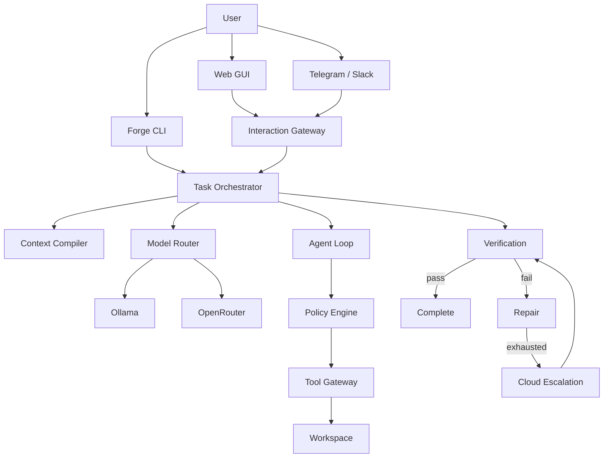

# Forge — Local-First Hybrid Autonomous Coding Harness

**Version:** `1.1.0-rc.1` · **Repo:** [LightLLM/Forge](https://github.com/LightLLM/Forge)

Forge is a **local-first, cloud-escalating autonomous software-engineering runtime** with a **Web GUI**, **CLI**, and **messaging channels** (Telegram / Slack) that all share one control plane.

You describe an objective. Forge understands the repository, builds context, routes to a model (preferring local Ollama), lets the model propose tool calls, authorizes and executes them under policy, verifies independently, repairs on failure, and optionally escalates to OpenRouter.

```text
MODEL PROPOSES → FORGE AUTHORIZES → TOOL EXECUTES → TESTS VERIFY → FORGE DECIDES
```

Forge—not the model—owns state, permissions, budgets, routing, verification, audit history, escalation, and termination.

## Interfaces (v1.1)

```text
 WEB GUI  ·  CLI  ·  Telegram  ·  Slack  ·  API
                    │
            INTERACTION GATEWAY  (127.0.0.1)
                    │
              Forge runtime
         (tasks · memory · policy · verify)
                    │
              Ollama / OpenRouter
```

| Surface | How to start |
|---------|----------------|
| **Web GUI** | `forge-harness start` → open http://127.0.0.1:8787/ |
| **CLI** | `forge-harness run "…"` |
| **Telegram / Slack** | Set bot tokens, then `forge-harness gateway start` (pairing required) |

**Desktop (DESKTOP-1):** Electron shell embeds the Forge GUI — no external browser.

```bash
pnpm desktop:dev
```

Shell choice and roadmap: [docs/desktop.md](docs/desktop.md) · [ADR](docs/adr/desktop-runtime.md). Installers arrive in DESKTOP-6+.

Docs: [docs/gui-gateway.md](docs/gui-gateway.md) · [docs/INSTALL.md](docs/INSTALL.md) · [docs/desktop.md](docs/desktop.md)

## Why local-first

- Keep source code on your machine by default
- Use free/local models via Ollama when they are good enough
- Escalate to cloud only when policy allows and local attempts fail
- Never silently send a `local-only` task to the cloud
- Web/gateway bind to **127.0.0.1** by default (not public)

## Architecture



See [docs/architecture.md](docs/architecture.md) for details.

## Security model

- Workspace path sandbox (blocks `../`, absolute paths, symlink escape)
- Command allowlist (no unconstrained shell)
- Repository content is **untrusted DATA** — it cannot grant permissions, change routing, raise budgets, or disable verification
- Secrets (`.env`, keys) are denied by policy and never logged
- Messaging channels require **pairing**; chat cannot escalate `local-only` → cloud

See [docs/security.md](docs/security.md).

## Requirements

- **Node.js 22+** (Windows, macOS, or Linux)
- Git
- pnpm (recommended) or npm
- Ollama (recommended for local inference)
- Optional: OpenRouter API key (cloud escalation)
- Optional: Docker (`commands.sandbox` = `auto` | `docker`)
- Optional: `TELEGRAM_BOT_TOKEN` / `SLACK_BOT_TOKEN` for messaging channels

## Installation

**Full guide (Windows / macOS / Linux):** [docs/INSTALL.md](docs/INSTALL.md)

### Quick install (clone + global link)

```bash
git clone https://github.com/LightLLM/Forge.git
cd Forge
```

**macOS / Linux:**

```bash
chmod +x scripts/install.sh
./scripts/install.sh
```

**Windows (PowerShell):**

```powershell
.\scripts\install.ps1
```

**Manual (all platforms):**

```bash
pnpm install   # or: npm install
pnpm build     # or: npm run build
npm install -g . --force
forge-harness --version
forge-harness doctor
```

`--force` is only needed if another tool already owns the `forge` name on your PATH; **`forge-harness` is the recommended command**.

### Install from GitHub without cloning

```bash
npm install -g github:LightLLM/Forge
# if `forge` conflicts with another tool:
# npm install -g github:LightLLM/Forge --force
```

### Develop inside the repo

```bash
pnpm install
pnpm forge -- doctor
```

> **Name collision:** Atlassian’s `@forge/cli` and Ethereum Foundry also ship a `forge` binary. This package exposes **`forge-harness`** as the unambiguous command. If `forge` on your PATH is another tool, use `forge-harness` or `pnpm forge` (in this repo).

### First project

```bash
cd your-project
forge-harness init
# copy .env.example → .env and set OLLAMA_MODEL
forge-harness doctor
forge-harness run "Fix the failing signup tests" --mode local-preferred
```

### Start the Web GUI (recommended)

From your project (or the Forge repo):

```bash
forge-harness start --port 8787
# → http://127.0.0.1:8787/
```

Or:

```bash
forge-harness gateway start --port 8787
```

In the GUI you can chat (ASK / PLAN / BUILD / DEBUG / REVIEW), watch live events, manage approvals and channel pairings, and inspect models/skills/memory — all against the **same** Forge runtime as the CLI.
## Ollama setup

1. Install [Ollama](https://ollama.com)
2. Pull a model of your choice, e.g. `ollama pull llama3.2`
3. Configure:

```bash
# .env (never commit)
OLLAMA_BASE_URL=http://localhost:11434
OLLAMA_MODEL=llama3.2
```

Forge does **not** hard-code a model name. You choose.

## OpenRouter setup (optional)

```bash
OPENROUTER_API_KEY=sk-or-...
OPENROUTER_MODEL=openai/gpt-4o-mini
OPENROUTER_MAX_COST_USD=1.0
```

Forge works in local-only mode without an OpenRouter key.

## Quick start

```bash
cd your-project
forge-harness init
forge-harness doctor
forge-harness models
forge-harness run "Fix the failing signup tests" --mode local-preferred
forge-harness status <task-id>
forge-harness inspect <task-id>
```

See [docs/INSTALL.md](docs/INSTALL.md) for platform-specific setup and troubleshooting.

### Routing modes

| Mode | Behavior |
|------|----------|
| `local-only` | Ollama only. Never cloud. |
| `local-preferred` | Ollama first; escalate after repair budget if cloud configured |
| `cloud-allowed` | May choose OpenRouter based on deterministic policy |

See [docs/model-routing.md](docs/model-routing.md).

## Configuration

`forge.config.json` (validated with Zod):

```json
{
  "mode": "local-preferred",
  "local": { "provider": "ollama", "model": "" },
  "cloud": { "provider": "openrouter", "model": "" },
  "limits": {
    "maxTurns": 20,
    "maxRepairs": 2,
    "timeoutMinutes": 30,
    "maxCloudCostUsd": 1
  },
  "scheduler": {
    "maxParallelWorkers": 2
  },
  "verification": {
    "typecheck": true,
    "lint": true,
    "test": true,
    "build": false,
    "gitDiffCheck": true
  }
}
```

Priority: CLI flags > environment > `forge.config.json` > defaults.

### v0.1 / v0.2 options

```json
{
  "commands": {
    "sandbox": "host",
    "dockerImage": "node:22-bookworm-slim",
    "dockerNetworkDisabled": true,
    "dockerHardened": true,
    "dockerMemoryLimit": "2g",
    "dockerPidsLimit": 256
  },
  "verification": {
    "playwright": "auto"
  },
  "git": {
    "createTaskBranch": false
  },
  "approvals": {
    "mode": "off",
    "risks": ["write", "execute"]
  },
  "ui": {
    "streamProgress": true
  }
}
```

- `commands.sandbox`: `host` (default), `auto` (Docker when available), or `docker` (required)
- `execution.backend`: `auto` | `local` | `docker` | `remote` (shared ExecutionBackend; remote is an adapter stub)
- `routing.adaptive`: rank among policy-allowed model candidates using performance history
- `routing.localCandidates` / `routing.cloudCandidates`: optional candidate lists for adaptive routing
- `commands.dockerHardened`: drop capabilities, no-new-privileges, read-only rootfs + tmpfs (default `true`)
- `verification.playwright`: run Playwright when detected (`auto`), force (`on`), or skip (`off`)
- `verification.browserQa`: run Forge browser scenarios when present (`auto`), force (`on`), or skip (`off`)
- `verification.browserQaDriver`: `auto` | `playwright` | `stub`
- `verification.architecture`: run architecture guardian when `.forge/architecture.json` present (`auto`), force (`on`), or skip (`off`)
- `git.createTaskBranch`: create `forge/<task-id>` before work (ignored when worktrees enabled)
- `git.useWorktrees`: isolate each task in `.forge/worktrees` via `git worktree`
- `git.acquireLease`: exclusive lease on the effective workspace path (auto-on with `useWorktrees`)
- `approvals.mode`: `off` | `prompt` (TTY / `FORGE_AUTO_APPROVE=1`) | `queue` (detached: `forge approve` / `forge deny`) | `deny-high-risk`
- `tools.packs`: built-in names (`repository`) and/or paths to modules exporting `createTools()`
- `FORGE_DATABASE_URL`: optional PostgreSQL URL (schema ensure + `PostgresStore` API; CLI agent loop still uses SQLite)
- `ui.streamProgress`: show Ollama streaming progress on stderr

## Verification

Forge independently runs configured checks (detected from `package.json` scripts where possible):

- typecheck
- lint
- unit tests
- build (optional)
- `git diff --check`

Model self-reports are never treated as success.

## CLI

| Command | Purpose |
|---------|---------|
| `forge init` | Create `forge.config.json` and `.env.example` |
| `forge doctor` | Health report (Node, Git, Ollama, OpenRouter, DB, verification) |
| `forge run "<objective>"` | Run a task |
| `forge status <task-id>` | Status + runs |
| `forge inspect <task-id>` | Full audit trail |
| `forge models` | Configured + available models |
| `forge approvals [task-id]` | List pending approvals |
| `forge approve <id>` | Approve a queued tool call |
| `forge deny <id>` | Deny a queued tool call |
| `forge memory list` | List engineering memories |
| `forge memory search <q>` | Keyword search memories |
| `forge memory inspect <id>` | Show one memory |
| `forge memory prune` | Retention prune (`--keep-latest` / `--older-than-days`) |
| `forge memory write` | Manually write project/decision memory |
| `forge skills list` | List built-in + workspace skills |
| `forge skills inspect <id>` | Show skill metadata and body |
| `forge skills match "<objective>"` | Preview skill selection |
| `forge mcp list` | List configured MCP servers |
| `forge mcp inspect <id>` | Advertise tools from a server |
| `forge mcp test <id> --tool <name>` | Call an allowlisted MCP tool |
| `forge mcp enable/disable <id>` | Toggle server in forge.config.json |
| `forge worktrees list` | List Forge-managed worktrees |
| `forge worktrees cleanup` | Prune abandoned worktrees (skips dirty) |
| `forge worktrees leases` | Show lease for current workspace |
| `forge worktrees conflicts <a> <b>` | Overlapping changed paths |
| `forge graph validate [plan]` | Validate a task DAG |
| `forge graph run <plan>` | Execute a task DAG (directive nodes) |
| `forge roles list` | List specialized agent roles |
| `forge roles inspect <id>` | Show role permissions/tools |
| `forge roles match "<objective>"` | Preview role selection |
| `forge browserqa list` | List browser QA scenarios |
| `forge browserqa run [id]` | Run browser QA scenarios |
| `forge browserqa demo` | Built-in login demo (stub driver) |
| `forge daemon start` | Start persistent daemon (queue + workers) |
| `forge daemon status` | Daemon + queue status |
| `forge daemon stop` | Stop daemon |
| `forge daemon enqueue <kind>` | Enqueue durable job (`echo`/`sleep`/`write_file`/`analysis`) |
| `forge jobs catalog` | List analysis types |
| `forge jobs run <id>` | Run analysis now (or `--enqueue`) |
| `forge jobs schedule <id>` | Create recurring schedule |
| `forge jobs schedules` | List schedules |
| `forge exec backends` | List local/docker/remote backend availability |
| `forge exec run "<cmd>"` | Run a command via ExecutionBackend |
| `forge goal "<objective>"` | Run a persistent multi-task goal |
| `forge goal resume <id>` | Resume goal after restart |
| `forge goal status [id]` | Show goal phase and task progress |
| `forge goal list` | List persisted goals |
| `forge eval run` | Run model evaluation dataset |
| `forge eval models` | Show recent eval summaries |
| `forge eval report [id]` | Detailed eval report JSON |
| `forge failures search "<query>"` | Retrieve prior failure fixes |
| `forge kg build` | Build repository knowledge graph |
| `forge kg deps <from> <to>` | Dependency path between files |
| `forge kg imports <file>` | List imports of a file |
| `forge dashboard start` | Local operator dashboard (same backend as CLI) |
| `forge start` / `forge gateway start` | Interaction Gateway API + web GUI + channels |
| `forge gateway status` | Gateway / channel health |
| `forge gateway channels` | Channel adapter status |
| `forge gateway pairings` | Pending Telegram/Slack pairings |
| `forge gateway setup` | Channel credential setup help |
| `forge skills propose` | Record a skill improvement proposal |
| `forge skills proposals` | List skill proposals |
| `forge skills apply-proposal` | Approve/install skill proposal (human only) |
| `forge approvals --restricted` | List restricted-action approvals |

`forge run` options: `--mode`, `--local-model`, `--cloud-model`, `--max-turns`, `--max-repairs`, `--timeout`, `--workspace`.

## Development

```bash
pnpm install
pnpm typecheck
pnpm lint
pnpm test
pnpm build
```

## Tests

```bash
pnpm test
```

Coverage includes state machine, policy, filesystem escape attempts, router modes, budgets, memory retrieval, skill routing, MCP allowlists, worktree isolation, task DAG scheduling, specialized roles, browser QA, persistent daemon crash recovery, scheduled background analyses, execution backends, goal mode, model evaluation, adaptive routing, failure corpus, knowledge graph, architecture guardian, restricted approvals, operator dashboard sync, skill improvement proposals, Forge v1 RC checklist, **Interaction Gateway API + SSE + fake-channel E2E**, and fake-provider end-to-end loops against `fixtures/broken-app`.

## Limitations (v1.1.0-rc.1)

- Single-machine SQLite is the default sync store for the agent loop
- PostgreSQL (`PostgresStore`) is available for programmatic/async use; full async orchestrator wiring is next
- Memory retrieval is keyword-based (no vector DB yet)
- Skills are guidance only (no skill-declared tools/permissions); selection is keyword/signal based
- MCP is stdio-only with explicit allowlists; outputs are untrusted DATA
- Worktrees are opt-in (`git.useWorktrees`); no automatic merge yet
- Task graphs use deterministic decomposition / plan JSON; CLI graph run uses directive executor (not full agent loop per node yet)
- Goal mode uses deterministic planning and directive node executor (not full agent loop per task yet)
- Model eval uses fake profiles by default; live provider benchmarks are manual
- Adaptive routing requires `routing.adaptive` and does not override `local-only` policy
- Failure corpus uses keyword retrieval; not yet injected into repair prompts automatically
- Knowledge graph is file-import based (symbols/routes/tables deferred)
- Architecture guardian primarily enforces `no_import` layer rules
- Web GUI is a localhost SPA served by the Gateway (not a separate Next.js app)
- WhatsApp channel is a stub until official Cloud API is wired
- Telegram/Slack need env tokens; unapproved users must pair in the GUI
- Skill proposals do not auto-cluster from failures yet
- Specialized roles filter tools/permissions per phase; multi-role pipelines are not yet one command
- Browser QA uses stub driver by default; Playwright is optional when installed
- Daemon job kinds include lightweight builtins + `analysis`; `agent_task` not wired to orchestrator yet
- Background analyses are heuristic/report-only (interval schedules; no cron); they never auto-rewrite code
- Remote ExecutionBackend is an adapter stub (no vendor provider connected yet)
- Docker sandbox is optional (`commands.sandbox`); default is `host`
- Hardened Docker may break tools that need writes outside `/workspace` or `/tmp`
- Deterministic relevance (no vector DB); improved with entrypoints, diffs, and import closure
- Conservative Git (no push/merge/force); optional task branches / worktrees only
- Approval `prompt` needs a TTY; use `queue` + `forge approve` for detached runs
- Tool packs cannot escalate privileges — PolicyEngine still decides
- Tool-calling quality depends on the selected model
- Global `forge` binary may collide with Atlassian Forge / Foundry — use `pnpm forge` or `forge-harness`

## Roadmap

See [docs/roadmap.md](docs/roadmap.md) and [docs/MILESTONES.md](docs/MILESTONES.md).

## License

MIT
