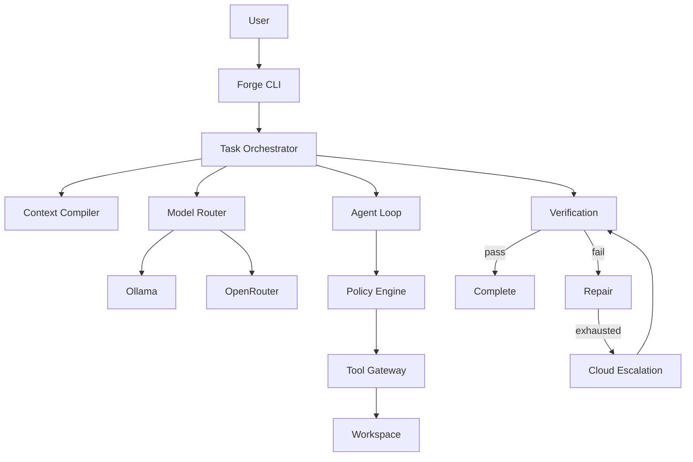

# Forge — Local-First Hybrid Autonomous Coding Harness

Forge is a **local-first, cloud-escalating autonomous software-engineering runtime**.

You describe an objective. Forge understands the repository, builds context, routes to a model (preferring local Ollama), lets the model propose tool calls, authorizes and executes them under policy, verifies independently, repairs on failure, and optionally escalates to OpenRouter.

```text
MODEL PROPOSES → FORGE AUTHORIZES → TOOL EXECUTES → TESTS VERIFY → FORGE DECIDES
```

Forge—not the model—owns state, permissions, budgets, routing, verification, audit history, escalation, and termination.

## Why local-first

- Keep source code on your machine by default
- Use free/local models via Ollama when they are good enough
- Escalate to cloud only when policy allows and local attempts fail
- Never silently send a `local-only` task to the cloud

## Architecture



See [docs/architecture.md](docs/architecture.md) for details.

## Security model

- Workspace path sandbox (blocks `../`, absolute paths, symlink escape)
- Command allowlist (no unconstrained shell)
- Repository content is **untrusted DATA** — it cannot grant permissions, change routing, raise budgets, or disable verification
- Secrets (`.env`, keys) are denied by policy and never logged

See [docs/security.md](docs/security.md).

## Requirements

- Node.js 22+
- pnpm
- Git
- Ollama (for local inference)
- Optional: OpenRouter API key (for cloud escalation)
- Optional: Docker (future sandbox backend; not required for v0)

## Installation

```bash
pnpm install
pnpm build
pnpm forge -- doctor
```

From this repository, prefer:

```bash
pnpm forge -- <command>
```

After `pnpm build`, you can also run `node dist/cli/index.js`.

> **Name collision:** Atlassian’s `@forge/cli` and Ethereum Foundry also ship a `forge` binary. This package also exposes `forge-harness` as an unambiguous alias. If `forge` on your PATH is another tool, use `pnpm forge` (in this repo) or `forge-harness` after linking this package.

## Ollama setup

1. Install [Ollama](https://ollama.com)
2. Pull a model of your choice, e.g. `ollama pull llama3.2`
3. Configure:

```bash
# .env (never commit)
OLLAMA_BASE_URL=http://localhost:11434
OLLAMA_MODEL=llama3.2
```

Forge does **not** hard-code a model name. You choose.

## OpenRouter setup (optional)

```bash
OPENROUTER_API_KEY=sk-or-...
OPENROUTER_MODEL=openai/gpt-4o-mini
OPENROUTER_MAX_COST_USD=1.0
```

Forge works in local-only mode without an OpenRouter key.

## Quick start

```bash
cd your-project
forge init
forge doctor
forge models
forge run "Fix the failing signup tests" --mode local-preferred
forge status <task-id>
forge inspect <task-id>
```

### Routing modes

| Mode | Behavior |
|------|----------|
| `local-only` | Ollama only. Never cloud. |
| `local-preferred` | Ollama first; escalate after repair budget if cloud configured |
| `cloud-allowed` | May choose OpenRouter based on deterministic policy |

See [docs/model-routing.md](docs/model-routing.md).

## Configuration

`forge.config.json` (validated with Zod):

```json
{
  "mode": "local-preferred",
  "local": { "provider": "ollama", "model": "" },
  "cloud": { "provider": "openrouter", "model": "" },
  "limits": {
    "maxTurns": 20,
    "maxRepairs": 2,
    "timeoutMinutes": 30,
    "maxCloudCostUsd": 1
  },
  "verification": {
    "typecheck": true,
    "lint": true,
    "test": true,
    "build": false,
    "gitDiffCheck": true
  }
}
```

Priority: CLI flags > environment > `forge.config.json` > defaults.

### v0.1 options

```json
{
  "commands": {
    "sandbox": "host",
    "dockerImage": "node:22-bookworm-slim",
    "dockerNetworkDisabled": true
  },
  "verification": {
    "playwright": "auto"
  },
  "git": {
    "createTaskBranch": false
  },
  "ui": {
    "streamProgress": true
  }
}
```

- `commands.sandbox`: `host` (default), `auto` (Docker when available), or `docker` (required)
- `verification.playwright`: run Playwright when detected (`auto`), force (`on`), or skip (`off`)
- `git.createTaskBranch`: create `forge/<task-id>` before work
- `ui.streamProgress`: show Ollama streaming progress on stderr

## Verification

Forge independently runs configured checks (detected from `package.json` scripts where possible):

- typecheck
- lint
- unit tests
- build (optional)
- `git diff --check`

Model self-reports are never treated as success.

## CLI

| Command | Purpose |
|---------|---------|
| `forge init` | Create `forge.config.json` and `.env.example` |
| `forge doctor` | Health report (Node, Git, Ollama, OpenRouter, DB, verification) |
| `forge run "<objective>"` | Run a task |
| `forge status <task-id>` | Status + runs |
| `forge inspect <task-id>` | Full audit trail |
| `forge models` | Configured + available models |

`forge run` options: `--mode`, `--local-model`, `--cloud-model`, `--max-turns`, `--max-repairs`, `--timeout`, `--workspace`.

## Development

```bash
pnpm install
pnpm typecheck
pnpm lint
pnpm test
pnpm build
```

## Tests

```bash
pnpm test
```

Coverage includes state machine, policy, filesystem escape attempts, router modes, budgets, and fake-provider end-to-end loops against `fixtures/broken-app`.

## Limitations (v0 / v0.1)

- Single-machine SQLite persistence via Node's experimental `node:sqlite`
- Docker sandbox is optional (`commands.sandbox`); default is `host` (safer with native `node_modules` on Windows/macOS)
- Deterministic relevance (no vector DB)
- Conservative Git (no push/merge/force); optional task branches only
- Tool-calling quality depends on the selected model
- OpenRouter cost may be reported as unknown when the API omits it
- Global `forge` binary may collide with Atlassian Forge / Foundry — use `pnpm forge` or `forge-harness`

## Roadmap

See [docs/roadmap.md](docs/roadmap.md).

## License

MIT
